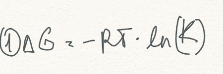
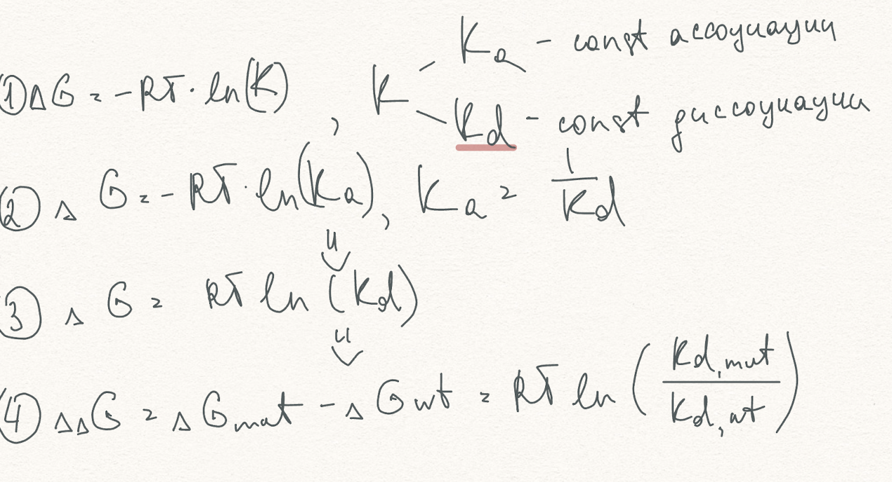

# ml-biocad-ddG
Мой проект на стажировку в биокад.
1. Постановка задачи. Как я поняла условие задания нужно предсказать не само значение изменения свободной энергии связывания (ddG), а знак изменения. Получается задача сходится к тому чтобы классифицировать мутации на «ухудшающие связывание» и «не ухудшающие». То есть бинарную классификацию. Получается:

2. Подготовка и исследование данных. Загрузив базу данных SKEMPI 2.0, я проанализировала какие столбцы важны. Нам данны столбцы с экспериментально измеренными константами сродства (affinity) белка с мутациями и без. Константа сродства K прямо связана со свободной энергией связывания ΔG, но сами по себе K-значения не линейны, поэтому для оценки изменения энергии следует использовать термодинамическую формулу. 
3. Главная формула. Для перевода отношения констант сродства в изменение свободной энергии используется формула изотермы Вант-Гоффа: 

Это общая формула. Нам даны значения константы диссоциации (Affinity_mut_parsed и Affinity_wt_parsed) в базе данных SKEMPI 2.0. Поэтому мы просто подставляем их в формулу (вместо константы сродства). И учитывая предыдущие формулы, выводим окончательную:

Используем физическую формулу, чтобы получить непрерывную величину, а затем переводим её в бинарную метку (ddG > 0 → «ухудшение», иначе → «нет ухудшения»).

4. Выбор и обработка признаков. Для модели я выбрала признаки, связанные с термодинамикой: аффинности до и после мутации, температуру, белки и место мутации. Категориальные данные закодировала, пропуски заполнила (средними и модой), числовые признаки стандартизировала для корректной работы алгоритмов. 

5. Выбор моделей. Для старта взяла простую, хорошо изученную логистическую регрессию — чтобы убедиться, что базовый алгоритм хотя бы как-то учится и выдаёт метрики. Затем попробовала более мощный алгоритм — градиентный бустинг на гистограммах (HistGradientBoosting), который часто лучше справляется с табличными данными и смешанными типами признаков. 

6. Обучение и оценка. Разбила данные на обучающую и тестовую части, чтобы проверить, насколько модель обобщается на «невидимые» примеры. Сравнила результаты: логистическая регрессия дала приемлемую, но смещённую в сторону одного класса точность, а градиентный бустинг показал почти идеальные метрики, что доказывает его способность выявлять зависимости в данных. 

7. Интерпретация результатов. Низкая эффективность логистической регрессии указывает на сложность и нелинейность зависимости между мутацией и изменением связывания. Высокая эффективность HGB говорит о том, что данные содержат достаточный объём сигналов, позволяющих надёжно классифицировать влияние мутации.
